# Introduction:


This python tool is a analytics platform for suppliers and buyers of active pharmaceutical ingredients and excipients. Providing unique market insights like price trends, this tool addresses the current lack of market transparency. 
For this purpose, we as a machine learning team analyze the data and then pre-processes the datasets and finally, we implement various machine learning algorithms like CNN, LSTM, HMM, Bi-directional LSTM to create various models only to estimate market prices/volumes which in turn help to strategic buyers and sales reps. While doing our experiment, this 
part of the work focuses on two areas to predict the future market prices of the drugs. They are:
1.	Regression Analysis 
2.	Bi-Directional LSTM (Long-Short Term Memory) models
	

The regression analysis part is used to create regression models for the painkillers and drug which later on used as baseline models. And, the bi-directional LSTM models are used
for time-series data to forecast more efficiently the pricing of the drugs.  

# Folder Structure - Regression Base Model + Bi-Directional LSTM Model

1. **baseline_models**: directory contains all the related folders and scripts files of regression model. 
  * [base_model_regression_paracetamol_weightedavg_data_norm_price.ipynb](baseline_models/base_model_regression_paracetamol_weightedavg_data_norm_price.ipynb) - Implement Paracetamol weighted average dataset
  * [base_model_regression_ibuprofen_weightedavg_data_norm_price.ipynb](baseline_models/base_model_regression_ibuprofen_weightedavg_data_norm_price.ipynb) - Implement Ibuprofen weighted average dataset
  * [base_model_regression_general_interpolated_data_norm_price.ipynb](baseline_models/base_model_regression_general_interpolated_data_norm_price.ipynb) - Implement regression models on the interpolated datasets of all the painkillers.
  * **Data:** Raw dataset of Paracetamol and Ibuprofen are in this sub-directory.
    * **interpolated** - containing all the interpolated datasets. 
  * **models** - containing all the generated regression models in this sub-directory.
  * **graphs** - this sub-directory contains all the results plots for regression base models.
   
2. **bidirlstm**: directory contains all the related folders and scripts files of bi-directional lstm models. 
  * [lstm_univariate_model_ibuprofen_price_nonorm.ipynb](bidirlstm/lstm_univariate_model_ibuprofen_price_nonorm.ipynb) - Initial lstm model with Ibuprofen dataset. Only price is taking as a feature.
  * [crude_oil_experiment_daily_crude_oil_bidirlstm.ipynb](bidirlstm/crude_oil_experiment_daily_crude_oil_bidirlstm.ipynb) - Implement a bidirlstm model with crude oil dataset. 
  * [crude_oil_experiment_monthly_crude_oil_bidirlstm.ipynb](bidirlstm/crude_oil_experiment_monthly_crude_oil_bidirlstm.ipynb) - Implement a bidirlstm model with crude oil dataset.
  * [crude_oil_experiment_weekly_crude_oil_bidirlstm.ipynb](bidirlstm/crude_oil_experiment_weekly_crude_oil_bidirlstm.ipynb) - Implement a bidirlstm model with crude oil dataset.
  * [crude_oil_bidirlstm_model_to_ibuprofen_price_test.ipynb](bidirlstm/crude_oil_bidirlstm_model_to_ibuprofen_price_test.ipynb) - Crude oil model used to test the Ibuprofen dataset.
  * [crude_oil_bidirlstm_model_to_paracetamol_price_test.ipynb](bidirlstm/crude_oil_bidirlstm_model_to_paracetamol_price_test.ipynb) - Crude oil model used to test Paracetamol dataset.
  * [bidir_lstm_multivariate_model_ibuprofen_price.ipynb](bidirlstm/bidir_lstm_multivariate_model_ibuprofen_price.ipynb) - Multivariate bidirlstm model by using Ibuprofen weighted average dataset. Target value: price.
  * [bidir_lstm_multivariate_model_ibuprofen_quantity.ipynb](bidirlstm/bidir_lstm_multivariate_model_ibuprofen_quantity.ipynb) - Multivariate bidirlstm model by using Ibuprofen weighted average dataset. Target value: quantity.
  * [bidir_lstm_multivariate_model_paracetamol_price.ipynb](bidirlstm/bidir_lstm_multivariate_model_paracetamol_price.ipynb) - Multivariate bidirlstm model by using Paracetamol weighted average dataset. Target value: price.
  * [bidir_lstm_multivariate_model_paracetamol_quantity.ipynb](bidirlstm/bidir_lstm_multivariate_model_paracetamol_quantity.ipynb) - Multivariate bidirlstm model by using Paracetamol weighted average dataset. Target value: quantity.
  * [bidir_lstm_multivariate_model_general_interpolated_data_price.ipynb](bidirlstm/bidir_lstm_multivariate_model_general_interpolated_data_price.ipynb) - Multivariate bidirlstm model for all the painkillers interpolated datasets. Target value: price. Test with Ibuprofen & Paracetamol interpolated datasets.
  * [bidir_lstm_multivariate_model_general_interpolated_data_quantity.ipynb](bidirlstm/bidir_lstm_multivariate_model_general_interpolated_data_quantity.ipynb) - Multivariate bidirlstm model for all the painkillers interpolated datasets. Target value: quantity. Test with Ibuprofen & Paracetamol interpolated datasets.
  * **Data**: Raw dataset of Paracetamol and Ibuprofen are in this sub-directory. 
    * **interpolated** - containing all the interpolated datasets. 
  * **models** - containing all the generated bidirectional models in this sub-directory.
  * **graphs** - this sub-directory contains all the results plots for bidirectional lstm models.

# Data Visualization and Pre-Processing

Our first task is to analysis the current painkillers/drugs datasets. We have given 2 datasets and our analysis is based on these 2 datasets. Datasets are: 
* [Ibuprofen](baseline_models/data/ibuprofen.csv)
* [Paracetamol](baseline_models/data/paracetamol.csv)

### Datasets Visualization

The dataset is collected from the QYOBO. The datasets contains multiple drug elements or painkillers. 

All datasets have 4 columns - dateUnix, dateIso, priceUsd, quantityKg

### Initial Plot

Original ibuprofen dataset SNS plot for dateUnix, priceUsd and quantityKg

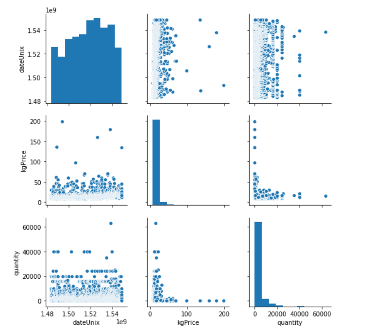

Original ibuprofen dataset plot (datetime vs price)

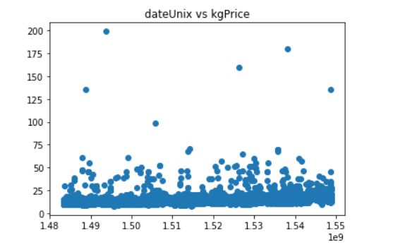

### Datasets Pre-Processing - Weighted Average 

From the initial plot, it was evident that there exist multiple data points for a single day. 
So, we use weighted average price for each day which make the dataset having one data point/day. 

The weighted average price is calculated by using below equation:

`weighted_price = sum(price * quantity) / sum(quantity)`

After implement this, the sns plot of ibuprofen for weighted average price and quantity :

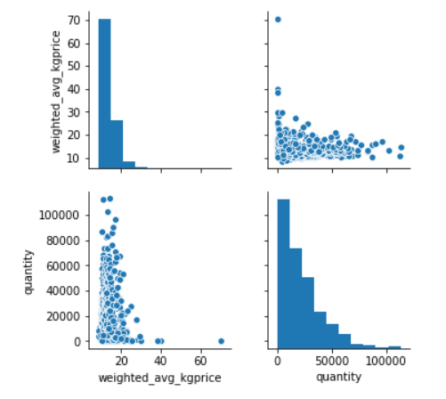

### Datasets Pre-Processing - Interpolated dataset

In the existing dataset, missing data problem is found in each dataset. It appears that for 
some month there is no price, quantity data to train the model. This issue was solved by using interpolation method. 
Details of the interpolation method are covered in the below link: 

[https://gitlab.com/qyobo/ml/blob/ali/README.md](https://gitlab.com/qyobo/ml/blob/ali/README.md)

### Dataset Normalization

Normalization typically means rescales the values into a range of [0,1]. 
So, below python script implement the normalization method for dataset. 

```python
def norm(x, stats):
    return (x - stats['min'])/(stats['max'] - stats['min'])
```

# Regression Analysis - Base Model 

In statistical modeling, regression analysis is a set of statistical processes for estimating the relationships among variables. It includes many techniques for modeling and 
analyzing several variables, when the focus is on the relationship between a dependent variable and one or more independent variables (or 'predictors') [[Reference]](https://en.wikipedia.org/wiki/Regression_analysis). 
This technique is used for forecasting, time-series modeling and finding the causal effect relationship between the variables. So, the regression analysis is an important 
tool for modeling and analyzing data. Here, we fit a curve or a line to the data points, in such a manner that the differences between the distances of data points from 
the curve or line are minimized. 

Therefore, in this work, we use regression models as our baseline models. We took the two painkillers datasets i.e. Ibuprofen and Paracetamol, and we fit a curve line to 
predict the prices of those drugs independently while using volume data as a dependent feature or value. 

Initially, we trained various regression models for QYOBO painkiller datasets.

### Build the regression model

Below is the regression model: 

```python
def build_model():
    #create model
    model = keras.Sequential() 
    
    #get number of columns in training data 
    n_cols = normed_train_data.shape[1]
    
    #add model layers
    model.add(layers.Dense(512, activation='relu', input_shape=(n_cols,)))
    model.add(layers.Dense(512, activation='relu'))
    model.add(layers.Dense(512, activation='relu'))
    model.add(layers.Dense(512, activation='relu'))
    model.add(layers.Dense(1))

    optimizer = keras.optimizers.Adam(lr=0.0001, beta_1=0.9, beta_2=0.999, epsilon=None, decay=0.0, amsgrad=False)
    model.compile(loss='mean_squared_error',
                optimizer=optimizer,
                metrics=['mean_absolute_error', 'mean_squared_error'])
    return model
```

Model summary and hyperparameters:

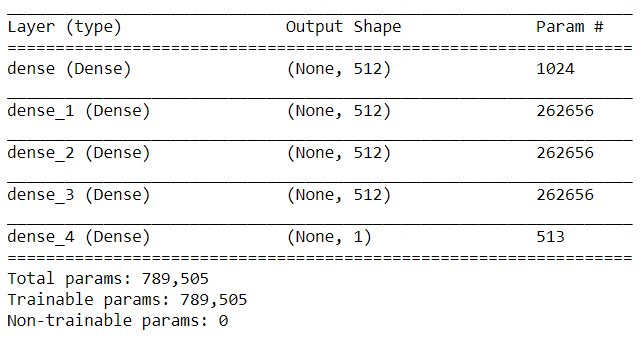

### Mean Absolute Percentage Error (MAPE) and R2 Metric

Mean Absolute Percentage Error, MAPE can be used to express the relative error. MAPE is a measure of prediction accuracy of a forecasting method 
in statistics, for example in trend estimation, also used as a loss function for regression problems in machine learning.
In MAPE, each data point is divided by the target value, giving relative error. MAPE can also be thought as weighted versions of MAE. [[Ref. Link]](https://en.wikipedia.org/wiki/Mean_absolute_percentage_error)

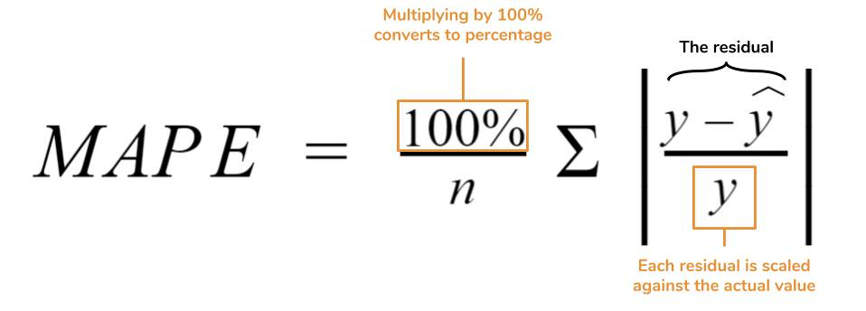

### R-Squared Metric

The R^2 (or R Squared) metric provides an indication of the goodness of fit of a set of predictions to the actual values. In statistical literature, 
this measure is called the coefficient of determination. This is a value between 0 and 1 for no-fit and perfect fit respectively. The higher the value is, 
the better the model is. [[Ref. Link]](https://en.wikipedia.org/wiki/Coefficient_of_determination)

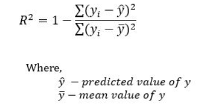

### Training Regression Model by Weighted Average Dataset

We trained the regression by using 2 weighted average dataset - a) ibuprofen b) paracetamol 

The training and validation loss curves are: 

Ibuprofen - Train and Validation loss                              |       Paracetamol - Train and Validation loss
:-----------------------------------------------------------------:|:-----------------------------------------------------:
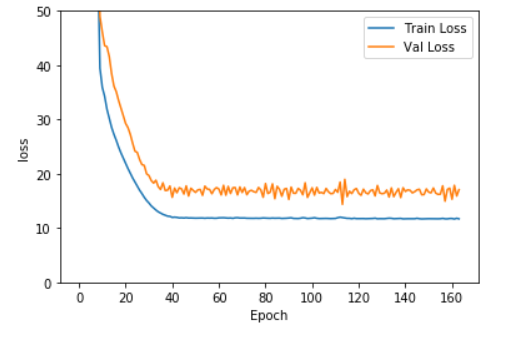 |  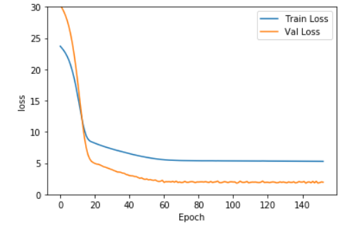


#### Test Predictions

Ibuprofen - Test prediction                                        |       Paracetamol - Test prediction
:-----------------------------------------------------------------:|:-----------------------------------------------------:
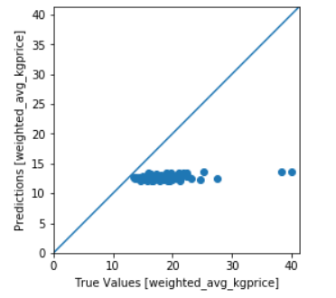|  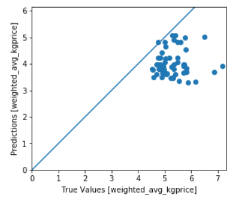


We also plot the prediction errors for daily and weekly basis on the test dataset for ibuprofen and paracetamol, respectively. 

Ibuprofen - prediction plot                                        |       Paracetamol - prediction plot
:-----------------------------------------------------------------:|:-----------------------------------------------------:
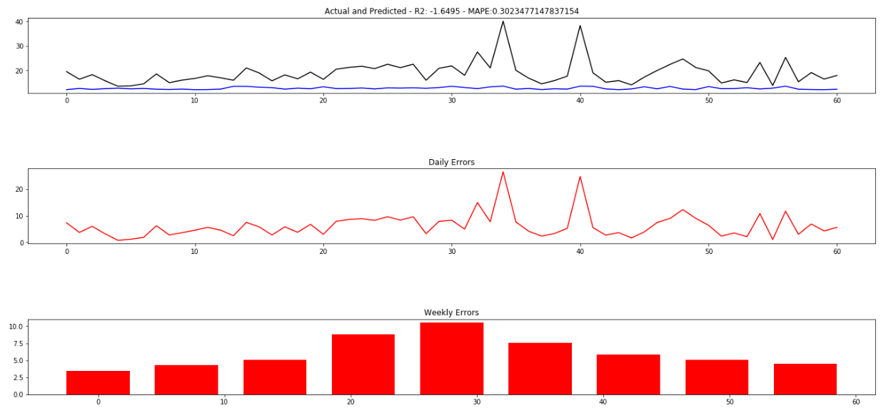       |  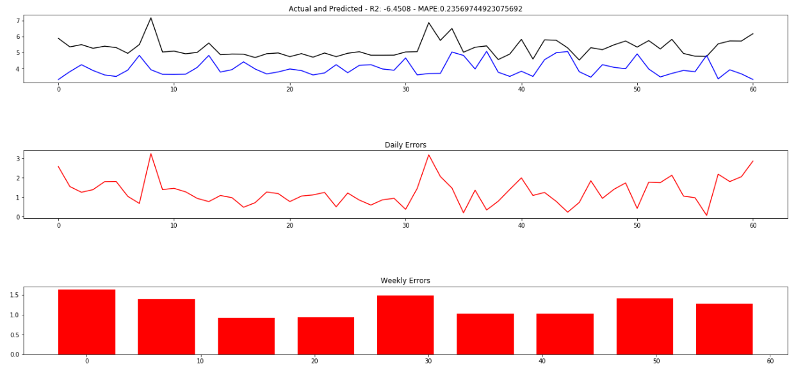

### Training Regression Model by Interpolated Dataset

Later, we trained the regression model by using interpolated datasets. For example, we trained interpolated dataset of a) ibuprofen b) paracetamol. 

The training and validation loss curves are: 

Ibuprofen - Train and Validation loss                              |       Paracetamol - Train and Validation loss
:-----------------------------------------------------------------:|:-----------------------------------------------------:
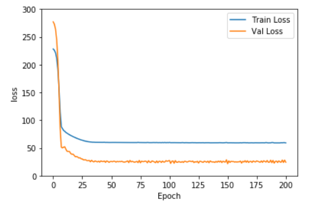 |  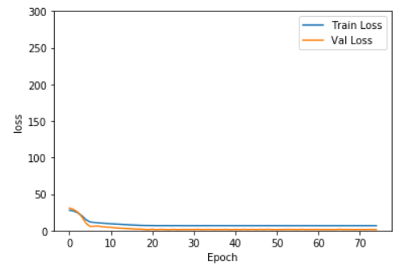

#### Test Predictions (Interpolated Dataset)

Ibuprofen - Test prediction                                        |       Paracetamol - Test prediction
:-----------------------------------------------------------------:|:-----------------------------------------------------:
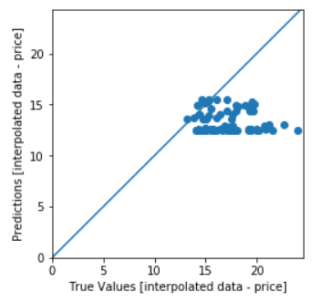|  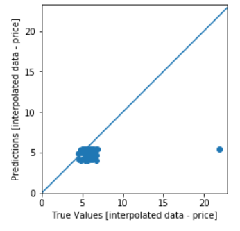


And plot the prediction errors for daily and weekly basis on the interpolated test dataset for ibuprofen and paracetamol, respectively, are: 

Ibuprofen - prediction plot                                        |       Paracetamol - prediction plot
:-----------------------------------------------------------------:|:-----------------------------------------------------:
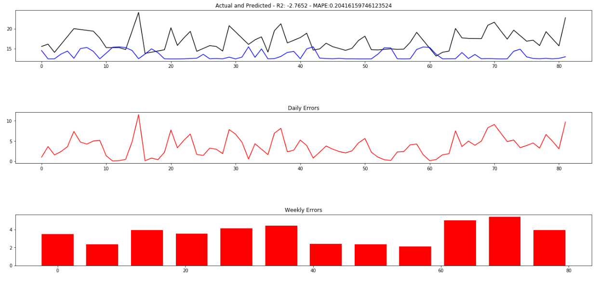       |  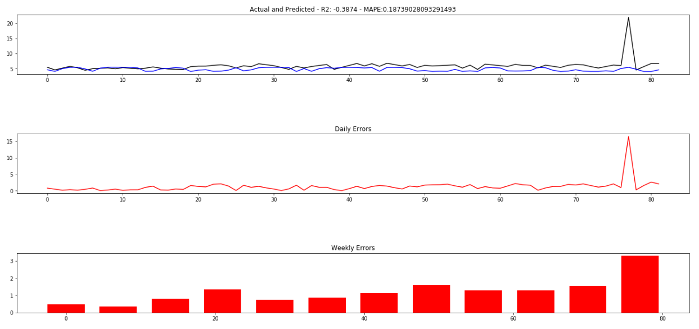

### General Scripts For All Painkillers

The below file contains the scripts to test any painkillers/drugs interpolated datasets for regression model analysis. 
* [base_model_regression_general_interpolated_data_norm_price.ipynb](baseline_models/base_model_regression_general_interpolated_data_norm_price.ipynb) - Implement regression models on the interpolated datasets of all the painkillers.

Below code snippet shows that it listed all the painkillers in a list. 
```python
#choosing current painkiller from the list to make the regression model
CURRENT_SUBSTANCE = '' 

# dictionaries key and value
KEY_PRICE_BASED = "P"
KEY_VOLUME_BASED = "V"

# In total 37 painkillers
ALL_PAINKILLERS_LIST = ['aceclofenac', 'acetylsalicylic-acid', 'benzydamine', 'celecoxib', 'choline-salicylate',
                        'dexibuprofen', 'diacerein', 'diclofenac', 'etodolac', 'etoricoxib', 
                        'feprazone', 'flurbiprofen', 'glucosamine', 'ibuprofen', 'ketoprofen', 
                        'ketorolac', 'lornoxicam', 'mefenamic-acid', 'meloxicam', 'metamizole-sodium', 
                        'nabumetone', 'naproxen', 'nimesulide', 'opium', 'paracetamol', 
                        'penicillamin', 'phenylbutazone', 'piroxicam', 'propyphenazone', 'salicylamide', 
                        'sodium-salicylate', 'tapentadol', 'tenoxicam', 'tilidine', 'tolfenamic-acid',
                        'tramadol', 'viminol']
```

**CURRENT_SUBSTANCE** is the variable which we have to assigned before starting to create the regression model by selecting desired painkillers index from the list like below code snippet:

```python
# Test with paracetamol, ibuprofen
CURRENT_SUBSTANCE = ALL_PAINKILLERS_LIST[24]
print(CURRENT_SUBSTANCE)

output: paracetamol
```
In the above example we select paracetamol.csv file by selecting it from the **ALL_PAINKILLERS_LIST** array which index is 24 and assigned it to **CURRENT_SUBSTANCE** variable.
### Test Results

**Table - 1: Regression models MAPE results for Paracetamol and Ibuprofen drugs for both weighted average and interpolated dataset.** 

| Painkillers/Drugs Name        | MAPE (Weighted Avg. Dataset)    | MAPE (Interpolated Dataset)  |
| ----------------------------- |:-------------------------------:| ----------------------------:|
| Paracetamol                   |        0.2356                   |       0.1873                 |
| Ibuprofen                     |        0.3023                   |       0.2041                 |

In both the elements, interpolated datasets is performed better than weighted average datasets. 

# Bi-Directional LSTM Model

Time series forecasting (TSF) is the task of predicting future values of a given sequence using historical data. LSTM (Long Short-Term Memory) are very good for analyzing 
sequences of values and predicting the next one. For example, LSTM could be a good choice if we want to predict the very next point of a given time series. On the other hand, 
bidirectional LSTM is another way of stacking LSTM layers. It use input data from the past and future to train the network.  The network consists of two linked layers, each 
layer performs the operations on the input sequence using a different flow direction. The bidirectional architecture uses one layer to perform the operations following the 
same flow direction of the data sequence. The other layer is reversely applying its operations on data sequence. Different merging methods are used to combine the final results 
produced by network layers. Correspondingly, two layers of LSTM can be stacked using two different flow directions for processing input sequence to form a bidirectional LSTM 
(BLSTM) architecture (Figure – 1)

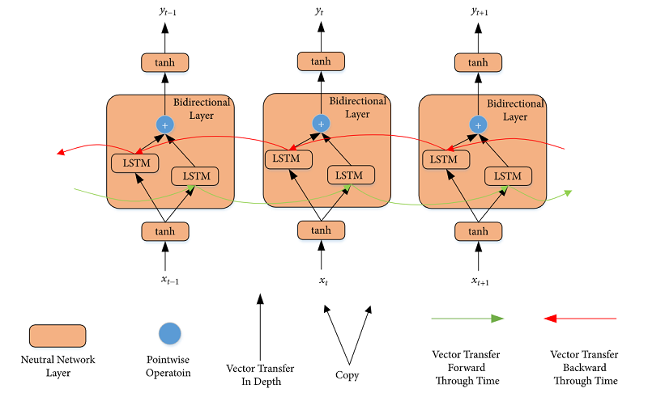

**Figure-1:** Standard bidirectional LSTM structure. For a bidirectional layer, it gets information from vertical direction (lower layer) and horizontal direction (past and future) 
and finally outputs the processed information for the upper layer.

Meanwhile, forecasting any stock market prices in the future requires using and learning from historical price data to store and model data patterns. Historical price data 
can be represented as time series for which many forecasting techniques have been proposed. Models can be trained for short- or long-term forecasting by the application of 
certain learning methodology. 

In this work, we have similar time series data i.e. painkillers/drugs dataset where we need to predict the future painkillers/drugs market prices. So, the methodology adopted 
by this work involves representing painkillers market price data as multivariate time series to train multiple models to perform both short- and long-term forecasting. We 
exploit and investigate applying to build the forecasting models by using different bidirectional LSTM networks for our multivariate time-series various datasets. 


## Initial Experiment - Univariate Model

So, the initial experiment was to train the Ibuprofen weighted average dataset by a simple LSTM network model to check that how the model is generalized our painkillers/drugs 
dataset. I used univariate dataset i.e. only taking the price feature and making a window size = 3 for creating a price dataset (weighted average) of Ibuprofen. The model parameters are:
* Batch size = 32
* Window size = 3
* Learning rate = 0.0001

After training, the training and validation loss is shown below:

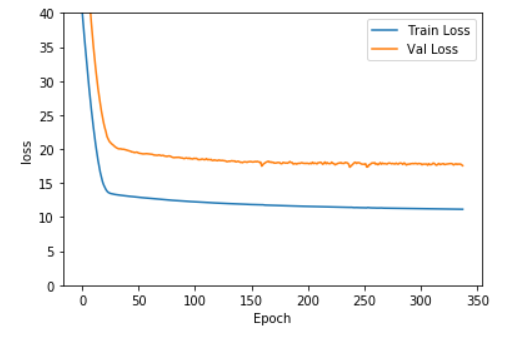

Also, the MAPE metric value generated from the test dataset is: 

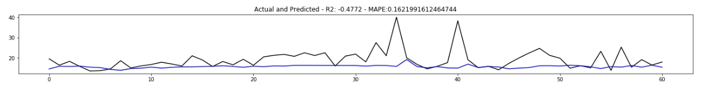

## Crude Oil Experiment - Model Building & Testing Painkillers/Drugs Dataset

It is evident from the above univariate model's training and validation loss plot that the validation is relatively very high than the training error. 
One of the main reason for this that the Ibuprofen dataset has only 601 data points (weighted average) i.e. it is too small. All our painkillers/drug 
datasets are initially very small. So, to get the notion of proper generalization, we need the large volume of similar sense of pricing datasets. 
That is why we choose to use 'Crud oil dataset'. The crude oil dataset has price and volume feature. Also, this dataset is filled with data from the 
April 1987 to end of May 2019. In our dataset, we had a maximum of 819 days of data point after implementing interpolation on the painkillers/drugs datasets, 
whereas, crude oil dataset have 9009 days or 1887 weeks or 434 months.

Since we have large crude oil dataset, we categorize the dataset in 3 categories i.e daily, weekly and monthly dataset to predict the future prices. 
The dataset files are:
* [[Daily]](bidirlstm/data/daily_crude_oil_83_19.csv)
* [[Weekly]](bidirlstm/data/weekly_crude_oil_83_19.csv)
* [[Monthly]](bidirlstm/data/monthly_crude_oil_83_19.csv)

**Network Model**

For crude oil experiment, I used below bi-directional LSTM network model:

```python
  def build_bidir_lstm_model(tensor_shape):
    # L2 norm regularizer
    regularizer = tf.keras.regularizers.l2(0.01)
    model = tf.keras.Sequential()

    # hyperbolic tangent is automatically seleceted as activation function
    units = tensor_shape[0]
    model.add(layers.Bidirectional(layers.LSTM(units, return_sequences=True), batch_input_shape=(None, tensor_shape[0], tensor_shape[1])))
       
    model.add(layers.Dense(32,activation='relu'))
    model.add(layers.Dense(32,activation='relu'))
    model.add(layers.Flatten())
    model.add(layers.Dense(1))
    return model
```

For all 3 categories - daily, weekly and monthly - the same network is used with below network training parameters: 
* Batch size = 64 
* Window size = 6
* Learning rate = 0.001
* Epochs = 10000
* L2-Regularizer = 0.01

The network generated 3 models (daily, weekly, and monthly) from 3 crude oil dataset. 
Later, we trained the Ibuprofen and Paracetamol dataset with these 3 crude oil models by loading their weights and get the full dataset and 60 days test 
dataset prediction for each of the mentioned painkillers. Results are given below: 

### Ibuprofen Results

**Full Dataset prediction**

Daily :
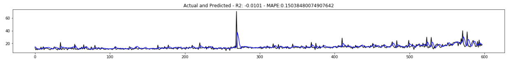

Weekly:
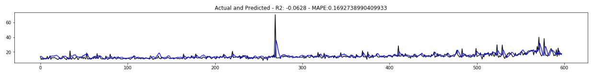

Monthly:
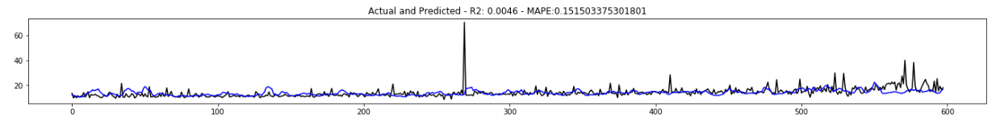

**Last 60 Datapoint Predictions** 

Daily:
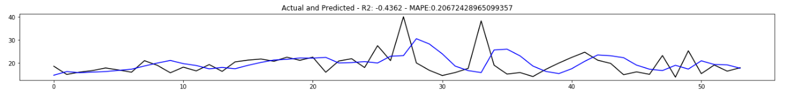

Weekly:
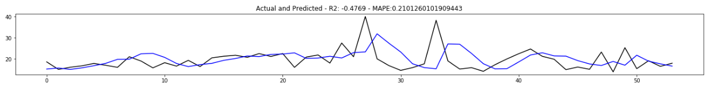

Monthly:
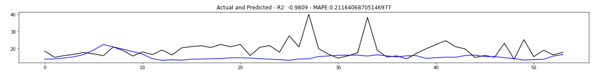

### Paracetamol Results

**Full Dataset prediction**

Daily :
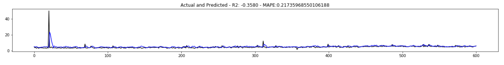

Weekly:
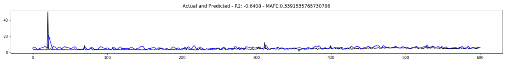

Monthly:
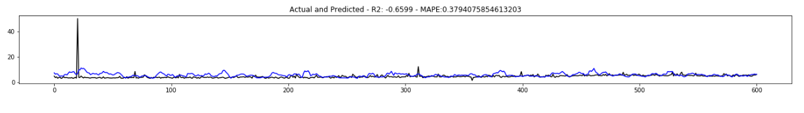

**Last 60 Datapoint Predictions** 

Daily:
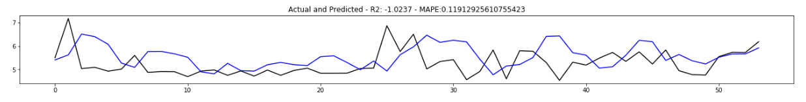

Weekly:
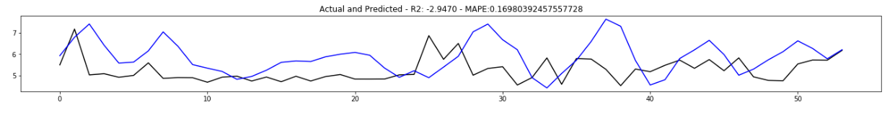

Monthly:
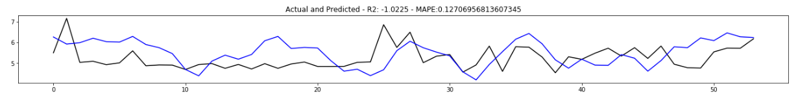


From the above results, we deduced that the models are working. For Ibuprofen, all the three models MAPE errors are less than the purely substance trained models errors. 
So, we found that the painkillers/drugs datasets needs to have a significant date range so that they can be trained properly.

Therefore, to train all the painkillers/drugs dataset, I divided them into 2 categories:
* Weighted Average Datasets
* Interpolated Datasets

## Bi-Directional LSTM Models With Weighted Average Datasets

Implemented network model is given below: 

```python
def build_model(tensor_shape):
    #create model
    model = keras.Sequential()
    units = tensor_shape[0]
    
    model.add(layers.Bidirectional(LSTM(units, return_sequences=True), batch_input_shape=(None, tensor_shape[0], tensor_shape[1])))
    model.add(Flatten())
    model.add(layers.Dense(1))    
    
    return model
```
All the models used the below network hyperparameters: 
* Batch size = 32
* Window size = 6
* Learning rate = 0.0001
* Epochs = 1000

And, we made 2 models for each of the drugs (Ibuprofen and Paracetamol) with normalized and non-normalzied weighted average datasets.

### Price Predictions

**Table - 2: Bi-Directional models MAPE results for Paracetamol and Ibuprofen drugs to predict price for normalized and non-normalized weighted average datasets.** 

| Painkillers/Drugs Name        | MAPE (Normalized)               | MAPE (Non-Normalized)        |
| ----------------------------- |:-------------------------------:| ----------------------------:|
| Paracetamol                   |        0.029                    |       0.75                   |
| Ibuprofen                     |        0.114                    |       0.16                   |

### Volume Predictions

**Table - 3: Bi-Directional models MAPE results for Paracetamol and Ibuprofen drugs to predict quantity for normalized and non-normalized weighted average datasets.** 

| Painkillers/Drugs Name        | MAPE (Normalized)               | MAPE (Non-Normalized)        |
| ----------------------------- |:-------------------------------:| ----------------------------:|
| Paracetamol                   |        0.12                    |       11.26                   |
| Ibuprofen                     |        0.42                    |        0.99                   |

## Bi-Directional LSTM Models With Interpolated Datasets

Like the previous sections, we also made 2 models for each of the drugs (Ibuprofen and Paracetamol) with normalized and non-normalzied interpolated datasets. 

### Price Predictions

**Ibuprofen Training**

After training, the training and validation loss curve shown below:

Normalized                                                                               |       Non-Normalized
:---------------------------------------------------------------------------------------:|:----------------------------------------------------------------------------------------------:
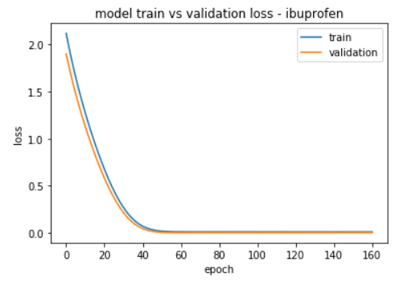 |  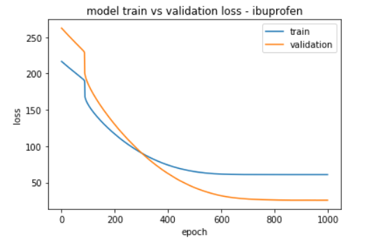

**Paracetamol Training**

After training, the training and validation loss curve shown below:

Normalized                                                                               |       Non-Normalized
:---------------------------------------------------------------------------------------:|:----------------------------------------------------------------------------------------------:
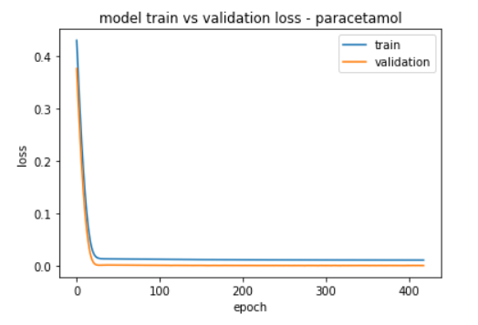 |  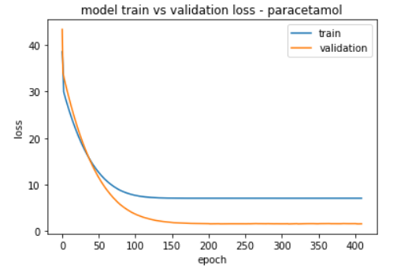

**Table - 4: Bi-Directional models MAPE results for Paracetamol and Ibuprofen drugs to predict price for normalized and non-normalized interpolated datasets.** 

| Painkillers/Drugs Name        | MAPE (Normalized)               | MAPE (Non-Normalized)        |
| ----------------------------- |:-------------------------------:| ----------------------------:|
| Paracetamol                   |        0.0281                   |       0.176                  |
| Ibuprofen                     |        0.0428                   |       0.8829                 |

### Volume Predictions

**Ibuprofen Training**

After training, the training and validation loss curve shown below:

Normalized                                                                               |       Non-Normalized
:---------------------------------------------------------------------------------------:|:----------------------------------------------------------------------------------------------:
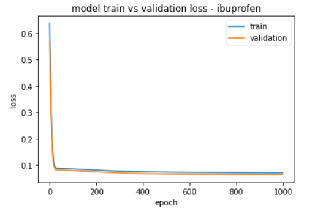 |  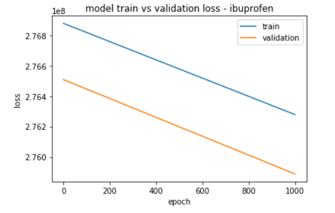

**Paracetamol Training**

After training, the training and validation loss curve shown below:

Normalized                                                                               |       Non-Normalized
:---------------------------------------------------------------------------------------:|:----------------------------------------------------------------------------------------------:
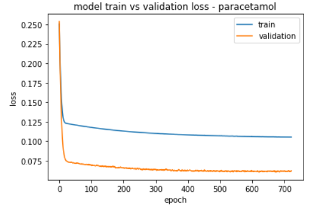 |  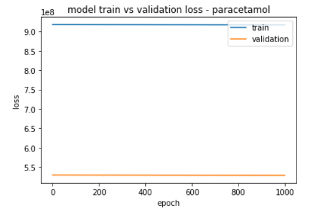

**Table - 5: Bi-Directional models MAPE results for Paracetamol and Ibuprofen drugs to predict price for normalized and non-normalized interpolated datasets.** 

| Painkillers/Drugs Name        | MAPE (Normalized)               | MAPE (Non-Normalized)        |
| ----------------------------- |:-------------------------------:| ----------------------------:|
| Paracetamol                   |        0.074                    |       0.9966                 |
| Ibuprofen                     |        0.925                    |       0.998                  |

## Best Models Plots

**Best price predictions models:**

Ibuprofen best model: [[bidirlstm_multivariate_model_ibuprofen_interpolated_data_price_norm.h5]](bidirlstm/models/bidirlstm_multivariate_model_ibuprofen_interpolated_data_price_norm.h5)
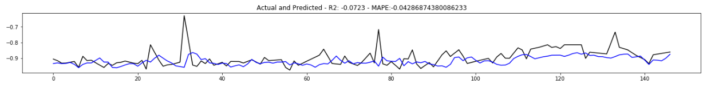

Paracetamol best model: [[bidirlstm_multivariate_model_paracetamol_interpolated_data_price_norm.h5]](bidirlstm/models/bidirlstm_multivariate_model_paracetamol_interpolated_data_price_norm.h5)
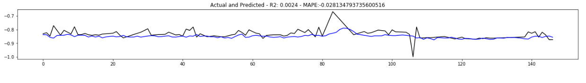

# Conclusion

In this section, regression models and bi-directional models are trained by using supplied Paracetamol and Ibuprofen weighted average and interpolated datasets. 
We used regression models as a base-line model. We found that in regression models normalized interpolated dataset is outperformed average weighted normalized dataset. 
The MAPE results of the regression models generated from interpolated datasets for Ibuprofen and Paracetamol drugs are 0.2041 and 0.1873, respectively, in the case of price 
predictions.

In the case of bi-directional LSTM models, all the multivariate models are outperforming univariate models. Here, we used both normalized and unnormalized weighted average 
and interpolated datasets to train by using the mentioned bi-directional LSTM models. It is evident from the various models' performance that all the multivariate models for 
different drugs for interpolated datasets outperform univariate models and also, normalized weighted average datasets. For example, for Paracetamol and Ibuprofen drugs, 
normalized interpolated datasets of those drugs have MAPE values of 0.0281 and 0.0428, respectively, which are lower than the MAPE results of normalized weighted average 
datasets i.e. 0.029 (for Paracetamol) and 0.114 (Ibuprofen). It is evident from the experiment that, in the future, multivariate correlated drugs with a high density of data 
without missing any data points can boost all the drug models' performance.
